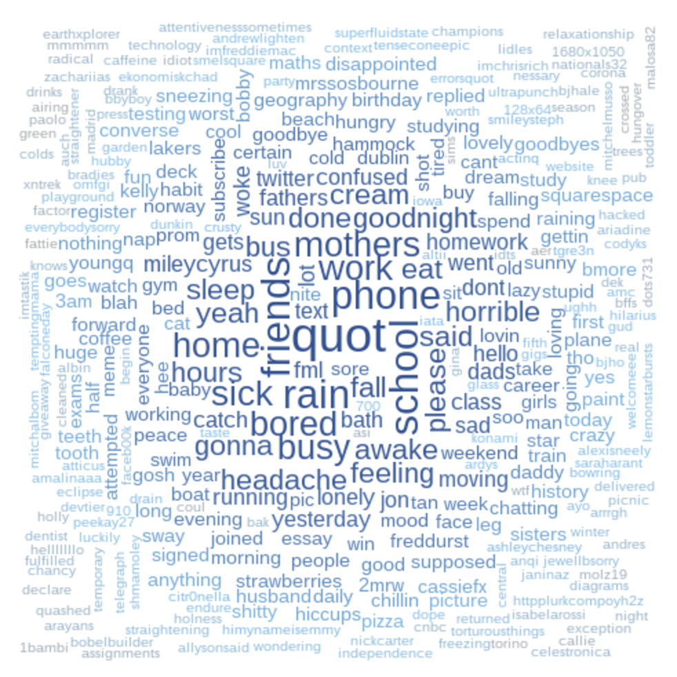

# Twitter-Sentiment-Analysis-with-TensorFlow
Attempt at Twitter sentiment Analysis in Tensor Flow inspired by sentdex (https://www.youtube.com/channel/UCfzlCWGWYyIQ0aLC5w48gBQ)

Please Note that this project uses the following python library versions:  

*python 3.5*  
*nltk (3.2.2)*  
*numpy (1.12.1)*  
*pickleshare (0.7.4)*  
*tensorflow (1.1.0)*  


Download Standford University provided [Sentiment 140 Dataset](http://help.sentiment140.com/for-students/)  




Under _Where is the training data?_ section of the site you can download the zip file from any of the two links provided.  
After this just download and unzip the `trainingandtestdata.zip` file.  

Inside the folder you will the following files which will act as data inputs to our code:  

 - testdata.manual.2009.06.14.csv
 - training.1600000.processed.noemoticon.csv 

move the contents of the now unzipped directory to your locally cloned repository.

Run the following python scripts in order _(Since this employs the CPU version of TensorFlow I recommend running "2." in the background)_:
1. `sentiment140_data_preprocessing.py`
2. `sentiment140_define_nn.py`  


Once the training is complete and you have an update `model.ckpt` file you can just do the following in a python terminal to see how the model classifies your own would be tweet:  
```
import sentiment140_define_nn.py

use_neural_network("@Lebron You are the boss!")
use_neural_network("I hate you!")

```

### Remember ...
This model will most likely not perform better than an end to end model with text data given from a specif context like movie dialouge etc. 
At the time of the last commit this model ignores all the tweets which showed 0 sentiment (neutrality).  
Maybe including this ouput class may have improved the Natural Language Classification of "new" or "contrived tweets"
